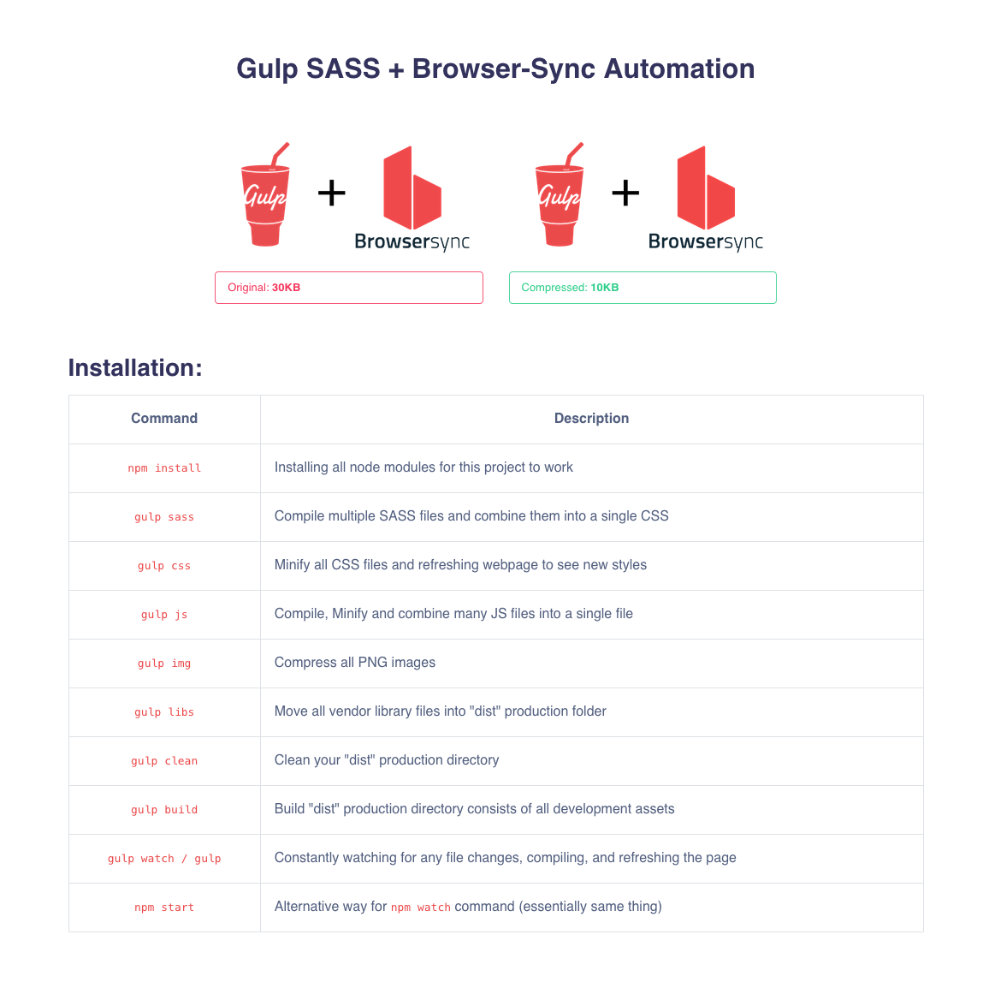

# Gulp Masterfy Assets

## 

### Requirements:

You need to have `node.js`, `npm` and `gulp.js` installed globally on your system before using this tool and commands available for this automation.

-   [node.js](https://nodejs.org/en/) - is a JavaScript runtime built on Chrome's V8 JavaScript engine.
-   [npm](https://www.npmjs.com/) - is node.js package manager for installing open-source JavaScript apps.
-   [gulp.js](https://gulpjs.com/) - A toolkit to automate & enhance your workflow

### Installation:

After downloading this repo, open this project folder within your terminal and run `npm install` command to install all of the dependencies and to unlock all the below tasks.

| Command        | Descriptions                                                                            |
| -------------- | --------------------------------------------------------------------------------------- |
| `npm install`  | Installing all dependencies for this application                                        |
| `gulp sass`    | Compiling all SASS into CSS and adding browser support prefixes                         |
| `gulp css`     | Compile, minify and combine CSS files into a single `.min.css` file                     |
| `gulp js`      | Compile, minify and combine JS files to a single file. Babel (ES5, ES6) support enabled |
| `gulp imgs`    | Compress and optimize image (`.png`, `.jpg`, `.gif` and `.svg`) graphic files           |
| `gulp vendors` | Copy all vendors / plugins lib files from src to dist directory                         |
| `gulp clean`   | Delete dist directory, use `gulp build` for fresh rebuilt                               |
| `gulp build`   | Build dist production directory from src directory                                      |
| `gulp watch`   | Watching and reloading browser on changes to (`.scss`, `.css`, `.js` and `.html`) files |
| `npm start`    | Alternative command for `gulp watch` command                                            |
